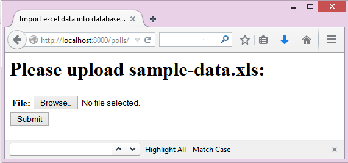
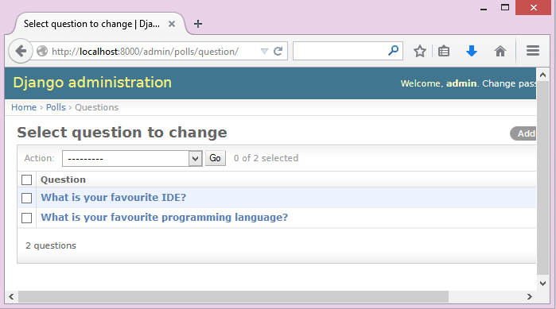
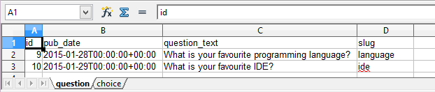
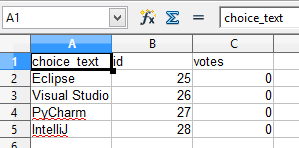

.. django-excel documentation master file, created by
   sphinx-quickstart on Wed Jan 07 08:46:32 2015.
   You can adapt this file completely to your liking, but it should at least
   contain the root `toctree` directive.

Welcome to django-excel's documentation!
================================================================================

:Author: C.W.
:Issues: http://github.com/pyexcel/django-excel/issues
:License: New BSD License
:Version: |version|
:Generated: |today|

**django-excel** is based on `pyexcel <https://github.com/pyexcel/pyexcel>`_ and makes
it easy to consume/produce information stored in excel files over HTTP protocol as
well as on file system. This library can turn the excel data into a list of lists,
a list of records(dictionaries), dictionaries of lists. And vice versa. Hence it
lets you focus on data in Django based web development, instead of file formats.

The idea originated from the common usability problem when developing an excel file
driven web applications for non-technical office workers: such as office assistant,
human resource administrator. It is an un-deniable fact that not all people know the
difference among various excel formats: csv, xls, xlsx. Instead of training those people
about file formats, this library helps web developers to handle most of the excel file
formats by providing a common programming interface.

.. note::
 Here is a typical conversation between the developer and the user::

  User: "I have uploaded an excel file as instructed, but your application says un-supported file format"
  Developer: "Did you upload an xlsx file or a csv file?"
  User: "Well, I am not sure. I saved the data using Microsoft Excel. Surely, it must be in an excel format."

The highlighted features are:

#. excel data import into and export from databases
#. turn uploaded excel file directly into Python data struture
#. pass Python data structures as an excel file download
#. provide data persistence as an excel file in server side
#. supports csv, tsv, csvz, tsvz by default and other formats are supported via
   the following plugins:

.. _file-format-list:

.. table:: A list of file formats supported by external plugins

   ================ ========================================
   Plugins          Supported file formats
   ================ ========================================
   `pyexcel-xls`_   xls, xlsx(r), xlsm(r)
   `pyexcel-xlsx`_  xlsx
   `pyexcel-ods3`_  ods (python 2.6, 2.7, 3.3, 3.4)
   `pyexcel-ods`_   ods (python 2.6, 2.7)
   `pyexcel-text`_  (write only)json, rst, mediawiki, html
                    latex, grid, pipe, orgtbl, plain simple
   ================ ========================================

.. _pyexcel-xls: https://github.com/pyexcel/pyexcel-xls
.. _pyexcel-xlsx: https://github.com/pyexcel/pyexcel-xlsx
.. _pyexcel-ods: https://github.com/pyexcel/pyexcel-ods
.. _pyexcel-ods3: https://github.com/pyexcel/pyexcel-ods3
.. _pyexcel-text: https://github.com/pyexcel/pyexcel-text

This library makes infomation processing involving various excel files as easy as
processing array, dictionary when processing file upload/download, data import into
and export from SQL databases, information analysis and persistence. It uses
**pyexcel** and its plugins:

#. to provide one uniform programming interface to handle csv, tsv, xls, xlsx, xlsm and ods formats.
#. to provide one-stop utility to import the data in uploaded file into a database and to export tables in a database as excel files for file download.
#. to provide the same interface for information persistence at server side: saving a uploaded excel file to and loading a saved excel file from file system.

Installation
-------------------

You can install it via pip:

.. code-block:: bash

    $ pip install django-excel

or clone it and install it:

.. code-block:: bash

    $ git clone http://github.com/pyexcel/django-excel.git
    $ cd django-excel
    $ python setup.py install

Installation of individual plugins , please refer to individual plugin page. For example, if you need xls file support, please install pyexcel-xls::

        $ pip install pyexcel-xls

Contrary to Django's phylosophy of 'battery included', django-excel does not
come with all batteries due to the size of the dependency(xlwt, openpyxl, odfpy). Hence,
Django developer is left with the choice to install and load the excel file formats.

Setup
------------------------
You will need to update your *settings.py*::

    FILE_UPLOAD_HANDLERS = ("django_excel.ExcelMemoryFileUploadHandler",
                            "django_excel.TemporaryExcelFileUploadHandler")

More excel file formats
------------------------

The example application understands csv, tsv and its zipped variants: csvz and tsvz. If you would like to expand the list of supported excel file formats (see :ref:`file-format-list`) for your own application, you could install one or all of the following::

    pip install pyexcel-xls
    pip install pyexcel-xlsx
    pip install pyexcel-ods

.. warning::

   If you are using pyexcel <=0.2.1, you still need to import each plugin manually, e.g. `import pyexcel.ext.xls` and
   Your IDE or pyflakes may highlight it as un-used but it is used. The registration of
   the extra file format support happens when the import action is performed

Tutorial
--------------

In order to dive in django-excel and get hands-on experience quickly, the test application for django-excel will be introduced here. So, it is advisable that you should check out the code from `github <https://github.com/pyexcel/django-excel>`_ ::

    git clone https://github.com/pyexcel/django-excel.git

The test application is written according to `Part 1 <https://docs.djangoproject.com/en/1.7/intro/tutorial01/>`_, `Part 2 <https://docs.djangoproject.com/en/1.7/intro/tutorial02/>`_ and `Part 3 <https://docs.djangoproject.com/en/1.7/intro/tutorial03/>`_ of django tutorial version 1.7.1. If you should wonder how the test application was written, please visit django documentation and come back.

Once you have the code, please change to django-excel directory and then install all dependencies::

    $ cd django-excel
    $ pip install -r requirements.txt
    $ pip install -r test_requirements.txt

Then run the test application::
   
    $ python manage.py runserver
    Performing system checks...
    
    System check identified no issues (0 silenced).
    January 29, 2015 - 18:11:06
    Django version 1.7.1, using settings 'mysite.settings'
    Starting development server at http://127.0.0.1:8000/
    Quit the server with CTRL-BREAK.

Handle excel file upload and download
++++++++++++++++++++++++++++++++++++++

This example shows how to process uploaded excel file and how to make data download as an excel file. Open your browser and visit http://localhost:8000/polls/, you shall see this upload form:

.. image :: upload-form.png

Choose an excel sheet, for example an xls file, and press "Submit". You will get a csv file for download.

.. image :: download-file.png

Please open the file `polls/views.py <https://github.com/pyexcel/django-excel/blob/master/polls/views.py#L27>`_ and focus on the following code section::

    class UploadFileForm(forms.Form):
        file = forms.FileField()
    
    # Create your views here.
    def upload(request):
        if request.method == "POST":
            form = UploadFileForm(request.POST, request.FILES)
            if form.is_valid():
                filehandle = request.FILES['file']
                return excel.make_response(filehandle.get_sheet(), "csv", file_name="download")
        else:
            form = UploadFileForm()
        return render_to_response('upload_form.html', {'form': form}, context_instance=RequestContext(request))

**UploadFileForm** is html widget for file upload form in the html page. Then look down at **filehandle**. It is an instance of either ExcelInMemoryUploadedFile or TemporaryUploadedExcelFile, which inherit ExcelMixin and hence have a list of conversion methods to call, such as get_sheet, get_array, etc.

For the response, :meth:`~django_excel.make_response` converts :class:`pyexcel.Sheet` instance obtained via :meth:`~django_excel.ExcelMixin.get_sheet` into a csv file for download.

Please feel free to change those functions according to :ref:`the mapping table <data-types-and-its-conversion-funcs>`.

Handle data import
++++++++++++++++++++++++++++++

This example shows how to import uploaded excel file into django models. We are going to import `sample-data.xls <https://github.com/pyexcel/django-excel/blob/master/sample-data.xls>`_

.. table:: Sheet 1 of sample-data.xls

    ============================================    ============    =================
    Question Text                                   Publish Date    Unique Identifier
    ============================================    ============    =================
    What is your favourite programming language?    28/01/15        language
    What is your favourite IDE?                     29/01/15        ide
    ============================================    ============    =================

.. table:: Sheet 2 of sample-data.xls

    ==========  ==============  ======         
    Question    Choice          Votes
    ==========  ==============  ======         
    language    Java            0
    language    C++             0
    language    C               0
    ide         Eclipse         0
    ide         Visual Studio   0
    ide         PyCharm         0
    ide         IntelliJ        0
    ==========  ==============  ======

into the following data models::
    
    class Question(models.Model):
        question_text = models.CharField(max_length=200)
        pub_date = models.DateTimeField('date published')
        slug = models.CharField(max_length=10, unique=True, default="question")
    
    
    class Choice(models.Model):
        question = models.ForeignKey(Question)
        choice_text = models.CharField(max_length=200)
        votes = models.IntegerField(default=0)

.. note::
   Except the added "slug" field, **Question** and **Choice** are copied from Django tutoial part 1.

Please visit this link http://localhost:8000/polls/import/, you shall see this upload form:

Please then select `sample-data.xls <https://github.com/pyexcel/django-excel/blob/master/sample-data.xls>`_ and upload. Then visit the admin page http://localhost:8000/admin/polls/question, you shall see questions have been populated:

.. note::
   The admin user credentials are: user name: admin, password: admin

And choices too:

.. image:: choice-admin.png

You may use admin interface to delete all those objects and try again. 

Now please open `polls/views.py <https://github.com/pyexcel/django-excel/blob/master/polls/views.py#L54>`_ and focus on this part of code::

    def import_data(request):
        if request.method == "POST":
            form = UploadFileForm(request.POST, request.FILES)
            def choice_func(row):
                print row[0]
                q = Question.objects.filter(slug=row[0])[0]
                row[0] = q
                return row
            if form.is_valid():
                request.FILES['file'].save_book_to_database(
                    models=[
                        (Question, ['question_text', 'pub_date', 'slug'], None, 0),
                        (Choice, ['question', 'choice_text', 'votes'], choice_func, 0) 
                     ]
                    )
                return HttpResponse("OK", status=200)
            else:
                return HttpResponseBadRequest()
        else:
        ...

The star is :meth:`~django_excel.save_book_to_database`. The parameter **models** can be a list of django models or a list of tuples, each of which contains:

1. django model (**compulsory**)
2. an array of model fields or a dicionary of key maps
3. custom formating fuction
4. the index of the row that has the field names
5. the index of the column that has the field names

When an array of model fields is supplied in the second member in the tuple, the names of the supplied fields should match the field names of the corresponding django model(the first member in the tuple) and the sequence of the supplied fields shall match the one in the uploaded excel sheet. For example::

    (Question, ['question_text', 'pub_date', 'slug'], None, 0)

When a dictionary of key maps is supplied, its keys should be the field names in the uploaded excel sheet and the value should be the actual field name in the corresponding django model. For example::

    (Question,{"Question Text": "question_text",
              "Publish Date": "pub_date",
              "Unique Identifier": "slug"}, None, 0)

The custom formatting function is needed when the data from the excel sheet needs translation before data import. For example, **Choice** has a foreign key to **Question**. When choice data are to be imported, "Question" column needs to be translated to a question instance. In our example, "Question" column in "Sheet 2" contains the values appeared in "Unique Identifier" column in "Sheet 1".

Handle data export
++++++++++++++++++++++++++++++

This section shows how to export the data in your models as an excel file. After you have completed the previous section, you can visit http://localhost:8000/polls/export/book and you shall get a file download dialog:

.. image:: download-dialog.png

Please save and open it. You shall see these data in your window:

.. image:: choice-sheet.png

Now let's examine the code behind this in `polls/views.py <https://github.com/pyexcel/django-excel/blob/master/polls/views.py#L48>`_::

    def export_data(request, atype):
        if atype == "sheet":
            return excel.make_response_from_a_table(Question, 'xls', file_name="sheet")
        elif atype == "book":
            return excel.make_response_from_tables([Question, Choice], 'xls', file_name="book")
        
:meth:`~django_excel.make_response_from_tables` does all what is needed: read out the data, convert them into xls and give it the browser. And what you need to do is to give a list of models to be exported and a file type. As you have noticed, you can visit http://localhost:8000/polls/export/sheet and will get **Question** exported as a single sheet file.

How to import one sheet instead of multi-sheet book
*****************************************************

Previous example shows how to import a multi-sheet book. However, what exactly is needed to import only one sheet instead? Before you proceed, please empty question and choice data using django admin.

Let's visit this url first http://localhost:8000/polls/imports_sheet/, where you see a similar file upload form. This time please choose `sample-sheet.xls <https://github.com/pyexcel/django-excel/blob/master/sample-sheet.xls>`_ instead. Then look at django admin and see if the question data have been imported or not.

Now let's look at the code::

    def import_sheet(request):
        if request.method == "POST":
            form = UploadFileForm(request.POST,
                                  request.FILES)
            if form.is_valid():
                request.FILES['file'].save_to_database(
                    name_columns_by_row=2,
                    model=Question,
                    mapdict=['question_text', 'pub_date', 'slug'])
                return HttpResponse("OK")
            else:
                return HttpResponseBadRequest()
        else:
           ...

Becuase it is a single sheet, the function to call is  :meth:`~django_excel.ExcelMixin.save_to_database` where you specify a model and its mapping dictionary.

Have you noticed the extra parameter 'name_columns_by_row'? Why is this needed? Well, normally you *will not need* that if you have column names in the first row. In this example, the column names appears in the second row. Please open `sample-sheet.xls <https://github.com/pyexcel/django-excel/blob/master/sample-sheet.xls>`_ and have a look. The straight answer is because the column names in the data appears in the 2nd row of the data matrix.

.. note::

   If you have imported earlier excel sheet "sample-data.xls", you will get the following warning in your console output::

       Warning: Bulk insertion got below exception. Trying to do it one by one slowly.
       column slug is not unique <- reason
       One row is ignored <- action
       column slug is not unique
       What is your favourite programming language?
       One row is ignored
       column slug is not unique
       What is your favourite IDE?

   This is because question data have been imported before. Django is raising IntegrityError. For more details please read `this part of code in pyexcel-io <https://github.com/pyexcel/pyexcel-io/blob/master/pyexcel_io/djangobook.py#L98>`_, and `django-excel issue 2 <https://github.com/pyexcel/django-excel/issues/2>`_

   In order to remove those warnings, what you can do is to empty all data using django admin and redo this single sheet import again.

What to do if import data overlaps existing data in the database
******************************************************************

With new version pyexcel-io v0.1.0, you could provide the row initialization function that returns None in order to skip a row in your import data. Inside the initialization function, you could also do database update. As long as it returns None, django-excel will try to do bulk create the import data.

Handle custom data export
+++++++++++++++++++++++++++++++

It is also quite common to download a portion of the data in a database table, for example the result of a search query. With version 0.0.2, you can pass on a query sets to to :meth:`~django_excel.make_response_from_query_sets` and generate an excel sheet from it::

    def export_data(request, atype):
	    ...
        elif atype == "custom":
            question = Question.objects.get(slug='ide')
            query_sets = Choice.objects.filter(question=question)
            column_names = ['choice_text', 'id', 'votes']
            return excel.make_response_from_query_sets(query_sets, column_names, 'xls', file_name="custom")

You can visit http://localhost:8000/polls/export/custom and will get the query set exported as a single sheet file as:

.. _data-types-and-its-conversion-funcs:

All supported data types
--------------------------

The example application likes to have array but it is not just about arrays. Here is table of functions for all supported data types:

=========================== ======================================================== ===================================================
data structure              from file to data structures                             from data structures to response
=========================== ======================================================== ===================================================
dict                        :meth:`~django_excel.ExcelMixin.get_dict`                :meth:`~django_excel.make_response_from_dict`
records                     :meth:`~django_excel.ExcelMixin.get_records`             :meth:`~django_excel.make_response_from_records`
a list of lists             :meth:`~django_excel.ExcelMixin.get_array`               :meth:`~django_excel.make_response_from_array`
dict of a list of lists     :meth:`~django_excel.ExcelMixin.get_book_dict`           :meth:`~django_excel.make_response_from_book_dict`
:class:`pyexcel.Sheet`      :meth:`~django_excel.ExcelMixin.get_sheet`               :meth:`~django_excel.make_response`
:class:`pyexcel.Book`       :meth:`~django_excel.ExcelMixin.get_book`                :meth:`~django_excel.make_response`
database table              :meth:`~django_excel.ExcelMixin.save_to_database`        :meth:`~django_excel.make_response_from_a_table` 
a list of database tables   :meth:`~django_excel.ExcelMixin.save_book_to_database`   :meth:`~django_excel.make_response_from_tables`
a database query sets                                                                :meth:`~django_excel.make_response_from_query_sets`
=========================== ======================================================== ===================================================

See more examples of the data structures in :ref:`pyexcel documentation<pyexcel:a-list-of-data-structures>`

API Reference
---------------

**django-excel** attaches **pyexcel** functions to **InMemoryUploadedFile** and **TemporaryUploadedFile**. Hence, the following functions are available for the uploaded files, e.g. request.FILES['your_uploaded_file'].

.. module:: django_excel.ExcelMixin

.. method:: get_sheet(sheet_name=None, **keywords)

   :param sheet_name: For an excel book, there could be multiple sheets. If it is left
                      unspecified, the sheet at index 0 is loaded. For 'csv', 'tsv' file,
                      *sheet_name* should be None anyway.
   :param keywords: additional keywords to :meth:`pyexcel.get_sheet`
   :returns: A sheet object

.. method:: get_array(sheet_name=None, **keywords)

   :param sheet_name: same as :meth:`~django_excel.ExcelMixin.get_sheet`
   :param keywords: additional keywords to pyexcel library
   :returns: a two dimensional array, a list of lists

.. method:: get_dict(sheet_name=None, name_columns_by_row=0, **keywords)

   :param sheet_name: same as :meth:`~django_excel.ExcelMixin.get_sheet`
   :param name_columns_by_row: uses the first row of the sheet to be column headers by default.
   :param keywords: additional keywords to pyexcel library
   :returns: a dictionary of the file content

.. method:: get_records(sheet_name=None, name_columns_by_row=0, **keywords)

   :param sheet_name: same as :meth:`~django_excel.ExcelMixin.get_sheet`
   :param name_columns_by_row: uses the first row of the sheet to be record field names by default.
   :param keywords: additional keywords to pyexcel library
   :returns: a list of dictionary of the file content

.. method:: get_book(**keywords)

   :param keywords: additional keywords to pyexcel library
   :returns: a two dimensional array, a list of lists

.. method:: get_book_dict(**keywords)

   :param keywords: additional keywords to pyexcel library
   :returns: a two dimensional array, a list of lists

.. method:: save_to_database(model=None, initializer=None, mapdict=None, **keywords)

   :param model: a django model
   :param initializer: a custom table initialization function if you have one
   :param mapdict: the explicit table column names if your excel data do not have the exact column names
   :param keywords: additional keywords to :meth:`pyexcel.Sheet.save_to_django_model`

.. method:: save_book_to_database(models=None, initializers=None, mapdicts=None, **keywords)

   :param models: a list of django models
   :param initializers: a list of model initialization functions.
   :param mapdicts: a list of explicit table column names if your excel data sheets do not have the exact column names
   :param keywords: additional keywords to :meth:`pyexcel.Book.save_to_django_models`

Response methods
-----------------

.. module:: django_excel

.. method:: make_response(pyexcel_instance, file_type, status=200)

   :param pyexcel_instance: :class:`pyexcel.Sheet` or :class:`pyexcel.Book`
   :param file_type: one of the following strings:
                     
                     * 'csv'
                     * 'tsv'
                     * 'csvz'
                     * 'tsvz'
                     * 'xls'
                     * 'xlsx'
                     * 'xlsm'
                     * 'ods'
                       
   :param status: unless a different status is to be returned.
         
.. method:: make_response_from_array(array, file_type, status=200)

   :param array: a list of lists
   :param file_type: same as :meth:`~django_excel.make_response`
   :param status: same as :meth:`~django_excel.make_response`
         
.. method:: make_response_from_dict(dict, file_type, status=200)

   :param dict: a dictinary of lists
   :param file_type: same as :meth:`~django_excel.make_response`
   :param status: same as :meth:`~django_excel.make_response`
         
.. method:: make_response_from_records(records, file_type, status=200)

   :param records: a list of dictionaries
   :param file_type: same as :meth:`~django_excel.make_response`
   :param status: same as :meth:`~django_excel.make_response`
         
             
.. method:: make_response_from_book_dict(book_dict, file_type, status=200)

   :param book_dict: a dictionary of two dimensional arrays
   :param file_type: same as :meth:`~django_excel.make_response`
   :param status: same as :meth:`~django_excel.make_response`

.. method:: make_response_from_a_table(model, file_type status=200)
   Produce a single sheet Excel book of *file_type*
	  
   :param model: a Django model
   :param file_type: same as :meth:`~django_excel.make_response`
   :param status: same as :meth:`~django_excel.make_response`

.. method:: make_response_from_query_sets(query_sets, column_names, file_type status=200)

   Produce a single sheet Excel book of *file_type* from your custom database queries

   :param query_sets: a query set
   :param column_names: a nominated column names. It could not be None, otherwise no data is returned.
   :param file_type: same as :meth:`~django_excel.make_response`
   :param status: same as :meth:`~django_excel.make_response`

.. method:: make_response_from_tables(models, file_type status=200)

   Produce a multiple sheet Excel book of *file_type*. It becomes the same
   as :meth:`~django_excel.make_response_from_a_table` if you pass *tables*
   with an array that has a single table
	  
   :param models: a list of Django models
   :param file_type: same as :meth:`~django_excel.make_response`
   :param status: same as :meth:`~django_excel.make_response`

Indices and tables
--------------------

* :ref:`genindex`
* :ref:`modindex`
* :ref:`search`

